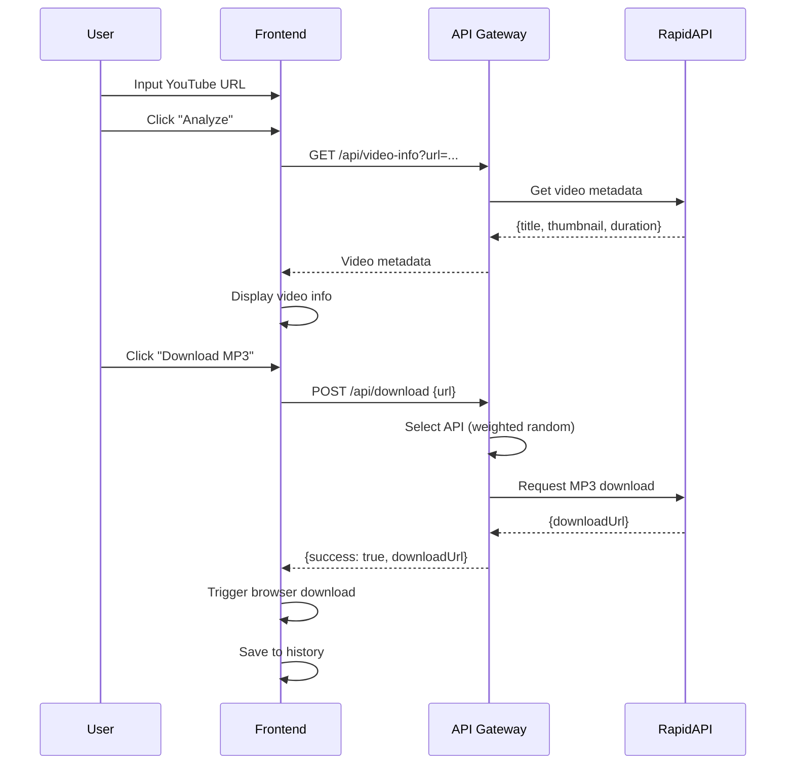
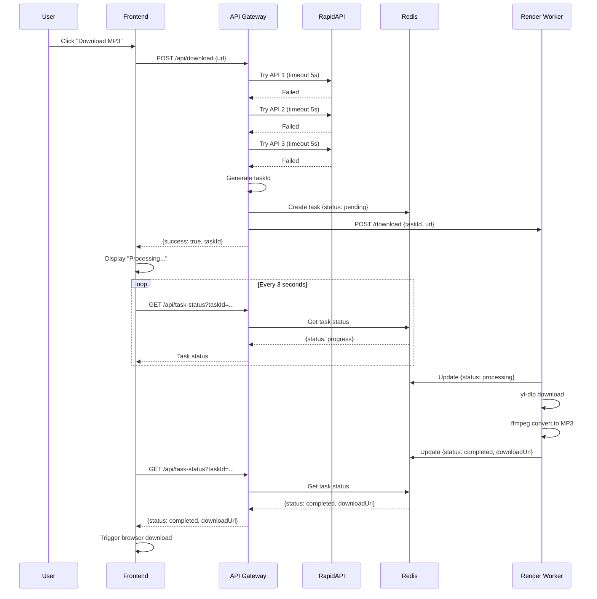

# Design Document

## Overview

This document outlines the technical design for the YouTube MP3 Downloader application. The system follows a multi-tier architecture with intelligent routing between fast third-party APIs and a reliable self-hosted worker service.

### Architecture Principles

1. **Cost Efficiency**: Maximize use of free-tier services
2. **Performance**: 80%+ requests complete in under 5 seconds
3. **Reliability**: 95%+ overall success rate through fallback mechanisms
4. **Simplicity**: Minimal dependencies, easy to maintain

### Technology Stack

- **Frontend**: HTML5, CSS3, Vanilla JavaScript (ES6+)
- **API Gateway**: Vercel Serverless Functions (Node.js 20.x)
- **Worker Service**: Render (Docker, Node.js 20.x, yt-dlp, ffmpeg)
- **State Management**: Upstash Redis (Serverless)
- **Third-party APIs**: RapidAPI (3 YouTube download endpoints)

## Architecture

### System Architecture Diagram

```
┌─────────────────────────────────────────────────────────�
â”?                   User Browser                          â”?
� ┌─────────────────────────────────────────────────�  �
â”? â”? Frontend Application (Vercel Static)           â”?  â”?
â”? â”? - index.html, style.css, app.js                â”?  â”?
â”? â”? - URL validation & video info display          â”?  â”?
â”? â”? - Download management & history                â”?  â”?
� └──────────────────┬──────────────────────────────�  �
└────────────────────┼────────────────────────────────────�
                     â”?HTTPS
                     �
┌─────────────────────────────────────────────────────────�
â”?          API Gateway (Vercel Serverless)                â”?
� ┌──────────────� ┌──────────────� ┌──────────────��
â”? â”?/api/        â”? â”?/api/        â”? â”?/api/        â”?â”?
â”? â”?video-info   â”? â”?download     â”? â”?task-status  â”?â”?
� └──────────────� └──────────────� └──────────────��
� ┌──────────────�                                      �
â”? â”?/api/health  â”?  Smart Router with Quota Management â”?
� └──────────────�                                      �
└────────┬────────────────────────┬───────────────────────�
         â”?                       â”?
         â”?Fast Track             â”?Stable Track
         �                       �
┌─────────────────────� ┌─────────────────────────────�
â”?  RapidAPI Hub      â”? â”?  Render Worker (Docker)    â”?
� ┌───────────────� � � ┌────────────────────────��
â”? â”?API 1: 300/mo â”? â”? â”? â”?Express Server         â”?â”?
â”? â”?youtube-mp36  â”? â”? â”? â”?- POST /download       â”?â”?
� └───────────────� � � �- GET /health          ��
� ┌───────────────� � � └────────────────────────��
� �API 2: 300/mo � � � ┌────────────────────────��
â”? â”?yt-api        â”? â”? â”? â”?yt-dlp + ffmpeg        â”?â”?
� └───────────────� � � �Task Queue (max 3)     ��
� ┌───────────────� � � └────────────────────────��
� �API 3: 500/day� � └─────────────────────────────�
â”? â”?media-dl      â”? â”?
� └───────────────� �
└─────────────────────�
         â”?                       â”?
         └────────────┬───────────�
                      �
         ┌─────────────────────────�
         â”?  Upstash Redis         â”?
         â”? - Task state storage   â”?
         â”? - API quota counters   â”?
         â”? - Rate limit tracking  â”?
         â”? - TTL: 24 hours        â”?
         └─────────────────────────�
```


### Request Flow Diagrams

#### Flow 1: Fast Track Success (60-70% of requests)



#### Flow 2: Stable Track Fallback (30-40% of requests)




## Components and Interfaces

### 1. Frontend Application

**File Structure:**
```
public/
├── index.html          # Main page structure
├── style.css           # Responsive styles
└── app.js              # Application logic
```

**Key Modules:**

#### URLValidator
```javascript
class URLValidator {
  static patterns = [
    /^https?:\/\/(www\.)?youtube\.com\/watch\?v=([a-zA-Z0-9_-]{11})/,
    /^https?:\/\/youtu\.be\/([a-zA-Z0-9_-]{11})/,
    /^https?:\/\/(www\.)?youtube\.com\/embed\/([a-zA-Z0-9_-]{11})/
  ];
  
  static validate(url) { /* Returns {valid, videoId} */ }
  static extractVideoId(url) { /* Returns videoId or null */ }
}
```

#### VideoInfoManager
```javascript
class VideoInfoManager {
  async fetchInfo(url) {
    // Calls /api/video-info
    // Returns {title, thumbnail, duration, author}
  }
  
  displayInfo(videoData) {
    // Updates DOM with video information
  }
}
```

#### DownloadManager
```javascript
class DownloadManager {
  async startDownload(url) {
    // Calls /api/download
    // Handles both fast track and async task responses
  }
  
  async pollTaskStatus(taskId) {
    // Polls /api/task-status every 3 seconds
    // Updates progress UI
  }
  
  triggerBrowserDownload(downloadUrl, filename) {
    // Creates temporary <a> element and clicks it
  }
}
```

#### HistoryManager
```javascript
class HistoryManager {
  saveDownload(videoData) {
    // Saves to localStorage (max 50 items)
  }
  
  getHistory() {
    // Returns array of download records
  }
  
  clearHistory() {
    // Removes all records from localStorage
  }
}
```

**UI Layout:**
```
┌─────────────────────────────────────────�
â”? Header: "YouTube MP3 Downloader"      â”?
├─────────────────────────────────────────��40% height
â”? [Input: YouTube URL] [Analyze Button] â”?
├─────────────────────────────────────────�
â”?                                        â”?
â”? Video Info Section (60% height)       â”?
� ┌───────────────────────────────────��
â”? â”?[Thumbnail]  Title                â”?â”?
â”? â”?             Duration: 3:45       â”?â”?
â”? â”?             Author: Channel Name â”?â”?
â”? â”?                                  â”?â”?
â”? â”? [Download MP3 Button]            â”?â”?
â”? â”? [Progress Bar] (if async)        â”?â”?
� └───────────────────────────────────��
â”?                                        â”?
â”? Download History                       â”?
� ┌───────────────────────────────────��
� ��Video 1 [Re-download]           ��
� ��Video 2 [Re-download]           ��
� └───────────────────────────────────��
└─────────────────────────────────────────�
```


### 2. API Gateway (Vercel Serverless Functions)

**File Structure:**
```
api/
├── video-info.js       # GET video metadata
├── download.js         # POST download request
├── task-status.js      # GET task status
├── health.js           # GET system health
└── lib/
    ├── redis-client.js     # Upstash Redis wrapper
    ├── rapidapi-client.js  # RapidAPI wrapper
    ├── quota-manager.js    # API quota tracking
    └── rate-limiter.js     # IP-based rate limiting
```

#### API Endpoint: /api/video-info

**Request:**
```http
GET /api/video-info?url=https://youtube.com/watch?v=VIDEO_ID
```

**Response (Success):**
```json
{
  "success": true,
  "data": {
    "videoId": "VIDEO_ID",
    "title": "Video Title",
    "thumbnail": "https://i.ytimg.com/vi/VIDEO_ID/maxresdefault.jpg",
    "duration": 225,
    "author": "Channel Name"
  }
}
```

**Implementation Logic:**
```javascript
// api/video-info.js
export default async function handler(req, res) {
  // 1. Extract and validate URL
  // 2. Try RapidAPI for metadata
  // 3. If fails, return basic info from URL parsing
  // 4. Return response within 2 seconds
}
```

#### API Endpoint: /api/download

**Request:**
```http
POST /api/download
Content-Type: application/json

{
  "url": "https://youtube.com/watch?v=VIDEO_ID"
}
```

**Response (Fast Track Success):**
```json
{
  "success": true,
  "type": "direct",
  "downloadUrl": "https://cdn.ytjar.xyz/get.php/...",
  "filename": "video-title.mp3"
}
```

**Response (Stable Track):**
```json
{
  "success": true,
  "type": "async",
  "taskId": "uuid-1234-5678-90ab",
  "status": "pending",
  "message": "Processing your request..."
}
```

**Implementation Logic:**
```javascript
// api/download.js
import { QuotaManager } from './lib/quota-manager.js';
import { RateLimiter } from './lib/rate-limiter.js';
import { RapidAPIClient } from './lib/rapidapi-client.js';
import { RedisClient } from './lib/redis-client.js';

export default async function handler(req, res) {
  // 1. Rate limiting check
  const clientIp = req.headers['x-forwarded-for'] || req.connection.remoteAddress;
  if (await RateLimiter.isLimited(clientIp)) {
    return res.status(429).json({ error: 'Too many requests' });
  }
  
  // 2. Validate URL
  const { url } = req.body;
  const videoId = extractVideoId(url);
  if (!videoId) {
    return res.status(400).json({ error: 'Invalid YouTube URL' });
  }
  
  // 3. Smart API selection with quota awareness
  const quotaManager = new QuotaManager();
  const apiPriority = await quotaManager.getAvailableAPIs();
  
  // 4. Try Fast Track (RapidAPI)
  for (const apiConfig of apiPriority) {
    try {
      const result = await RapidAPIClient.download(videoId, apiConfig);
      if (result.success) {
        await quotaManager.incrementUsage(apiConfig.name);
        return res.json({
          success: true,
          type: 'direct',
          downloadUrl: result.link,
          filename: sanitizeFilename(result.title) + '.mp3'
        });
      }
    } catch (error) {
      // Continue to next API
    }
  }
  
  // 5. Fallback to Stable Track (Render Worker)
  const taskId = generateUUID();
  const task = {
    taskId,
    status: 'pending',
    videoUrl: url,
    videoId,
    progress: 0,
    createdAt: Date.now()
  };
  
  await RedisClient.setTask(taskId, task);
  
  // Send to Render Worker (fire and forget)
  fetch(process.env.RENDER_WORKER_URL + '/download', {
    method: 'POST',
    headers: { 'Content-Type': 'application/json' },
    body: JSON.stringify({ taskId, url })
  }).catch(err => console.error('Render Worker error:', err));
  
  return res.json({
    success: true,
    type: 'async',
    taskId,
    status: 'pending'
  });
}
```


#### API Endpoint: /api/task-status

**Request:**
```http
GET /api/task-status?taskId=uuid-1234-5678-90ab
```

**Response:**
```json
{
  "success": true,
  "task": {
    "taskId": "uuid-1234-5678-90ab",
    "status": "processing",
    "progress": 45,
    "videoTitle": "Video Title",
    "downloadUrl": null,
    "error": null
  }
}
```

**Implementation Logic:**
```javascript
// api/task-status.js
export default async function handler(req, res) {
  const { taskId } = req.query;
  
  const task = await RedisClient.getTask(taskId);
  
  if (!task) {
    return res.status(404).json({
      success: false,
      error: 'Task not found or expired'
    });
  }
  
  return res.json({ success: true, task });
}
```

#### API Endpoint: /api/health

**Response:**
```json
{
  "status": "healthy",
  "timestamp": 1698765432000,
  "services": {
    "redis": { "status": "ok", "latency": 12 },
    "rapidapi": { "status": "ok", "quotaRemaining": 245 },
    "renderWorker": { "status": "ok", "uptime": 86400 }
  }
}
```

### 3. Render Worker Service

**File Structure:**
```
worker/
├── Dockerfile
├── package.json
├── server.js           # Express server
├── download-handler.js # yt-dlp + ffmpeg logic
├── task-queue.js       # Concurrent task management
└── redis-client.js     # Upstash Redis client
```

#### Dockerfile

```dockerfile
FROM node:20-alpine

# Install system dependencies
RUN apk add --no-cache \
    python3 \
    py3-pip \
    ffmpeg

# Install yt-dlp
RUN pip3 install --upgrade yt-dlp

# Set working directory
WORKDIR /app

# Copy package files
COPY package*.json ./

# Install Node.js dependencies
RUN npm ci --only=production

# Copy application code
COPY . .

# Expose port
EXPOSE 3000

# Health check
HEALTHCHECK --interval=30s --timeout=3s --start-period=5s --retries=3 \
  CMD node -e "require('http').get('http://localhost:3000/health', (r) => {process.exit(r.statusCode === 200 ? 0 : 1)})"

# Start server
CMD ["node", "server.js"]
```

#### Express Server

```javascript
// worker/server.js
const express = require('express');
const DownloadHandler = require('./download-handler');
const TaskQueue = require('./task-queue');

const app = express();
app.use(express.json());

const taskQueue = new TaskQueue({ maxConcurrent: 3 });

// Health check endpoint
app.get('/health', (req, res) => {
  res.json({
    status: 'ok',
    uptime: process.uptime(),
    timestamp: Date.now(),
    queueSize: taskQueue.size()
  });
});

// Download endpoint
app.post('/download', async (req, res) => {
  const { taskId, url } = req.body;
  
  // Validate input
  if (!taskId || !url) {
    return res.status(400).json({ error: 'Missing taskId or url' });
  }
  
  // Add to queue (non-blocking)
  taskQueue.add(async () => {
    await DownloadHandler.process(taskId, url);
  });
  
  // Respond immediately
  res.json({ success: true, message: 'Task queued' });
});

const PORT = process.env.PORT || 3000;
app.listen(PORT, () => {
  console.log(`Worker server running on port ${PORT}`);
});
```


#### Download Handler

```javascript
// worker/download-handler.js
const { exec } = require('child_process');
const { promisify } = require('util');
const path = require('path');
const fs = require('fs').promises;
const RedisClient = require('./redis-client');

const execAsync = promisify(exec);

// Sanitize filename to prevent path traversal and filesystem errors
function sanitizeFilename(filename) {
  return filename
    .replace(/[<>:"/\\|?*\x00-\x1F]/g, '') // Remove illegal characters
    .replace(/^\.+/, '') // Remove leading dots
    .replace(/\s+/g, '-') // Replace spaces with hyphens
    .substring(0, 200); // Limit length
}

class DownloadHandler {
  static async process(taskId, url) {
    const tempDir = `/tmp/${taskId}`;
    const timeout = 120000; // 120 seconds
    
    try {
      // Update status to processing
      await RedisClient.updateTask(taskId, {
        status: 'processing',
        progress: 10
      });
      
      // Create temp directory
      await fs.mkdir(tempDir, { recursive: true });
      
      // Download video with yt-dlp
      const ytdlpCmd = `yt-dlp -x --audio-format mp3 --audio-quality 128K \
        -o "${tempDir}/%(title)s.%(ext)s" \
        --no-playlist \
        --max-filesize 100M \
        "${url}"`;
      
      await RedisClient.updateTask(taskId, { progress: 30 });
      
      const { stdout, stderr } = await execAsync(ytdlpCmd, {
        timeout,
        maxBuffer: 10 * 1024 * 1024 // 10MB buffer
      });
      
      await RedisClient.updateTask(taskId, { progress: 80 });
      
      // Find the downloaded file
      const files = await fs.readdir(tempDir);
      const mp3File = files.find(f => f.endsWith('.mp3'));
      
      if (!mp3File) {
        throw new Error('MP3 file not found after conversion');
      }
      
      const filePath = path.join(tempDir, mp3File);
      
      // Hybrid storage strategy based on file size
      const stats = await fs.stat(filePath);
      const fileSizeMB = stats.size / (1024 * 1024);
      
      let downloadUrl;
      
      if (fileSizeMB < 5) {
        // Small files: use base64 data URL (fast, no external dependency)
        const fileBuffer = await fs.readFile(filePath);
        const base64Data = fileBuffer.toString('base64');
        downloadUrl = `data:audio/mpeg;base64,${base64Data}`;
      } else {
        // Large files: upload to Cloudflare R2 (avoids Redis 10MB limit)
        downloadUrl = await this.uploadToR2(filePath, taskId, mp3File);
      }
      
      // Update task as completed
      await RedisClient.updateTask(taskId, {
        status: 'completed',
        progress: 100,
        downloadUrl,
        filename: mp3File
      });
      
      // Cleanup
      await fs.rm(tempDir, { recursive: true, force: true });
      
    } catch (error) {
      console.error(`Task ${taskId} failed:`, error);
      
      // Update task as failed
      await RedisClient.updateTask(taskId, {
        status: 'failed',
        error: error.message,
        progress: 0
      });
      
      // Cleanup on error
      try {
        await fs.rm(tempDir, { recursive: true, force: true });
      } catch (cleanupError) {
        console.error('Cleanup error:', cleanupError);
      }
    }
  }
}

  // Upload to Cloudflare R2
  static async uploadToR2(filePath, taskId, filename) {
    const { S3Client, PutObjectCommand } = require('@aws-sdk/client-s3');
    
    const r2Client = new S3Client({
      region: 'auto',
      endpoint: process.env.R2_ENDPOINT,
      credentials: {
        accessKeyId: process.env.R2_ACCESS_KEY_ID,
        secretAccessKey: process.env.R2_SECRET_ACCESS_KEY
      }
    });
    
    const fileBuffer = await fs.readFile(filePath);
    const key = `${taskId}/${filename}`;
    
    const uploadCommand = new PutObjectCommand({
      Bucket: process.env.R2_BUCKET_NAME,
      Key: key,
      Body: fileBuffer,
      ContentType: 'audio/mpeg',
      Metadata: {
        'expires-at': (Date.now() + 86400000).toString() // 24 hours
      }
    });
    
    await r2Client.send(uploadCommand);
    
    return `${process.env.R2_PUBLIC_URL}/${key}`;
  }
}

module.exports = DownloadHandler;
```

#### Task Queue

```javascript
// worker/task-queue.js
class TaskQueue {
  constructor({ maxConcurrent = 3 }) {
    this.maxConcurrent = maxConcurrent;
    this.running = 0;
    this.queue = [];
  }
  
  add(taskFn) {
    this.queue.push(taskFn);
    this.process();
  }
  
  async process() {
    if (this.running >= this.maxConcurrent || this.queue.length === 0) {
      return;
    }
    
    this.running++;
    const taskFn = this.queue.shift();
    
    try {
      await taskFn();
    } catch (error) {
      console.error('Task execution error:', error);
    } finally {
      this.running--;
      this.process(); // Process next task
    }
  }
  
  size() {
    return this.queue.length;
  }
}

module.exports = TaskQueue;
```


## Data Models

### Task Object (Redis)

```typescript
interface Task {
  taskId: string;              // UUID v4
  status: 'pending' | 'processing' | 'completed' | 'failed';
  videoUrl: string;            // Original YouTube URL
  videoId: string;             // Extracted video ID
  videoTitle?: string;         // Video title (optional)
  progress: number;            // 0-100
  downloadUrl?: string;        // Available when status = 'completed'
  filename?: string;           // MP3 filename
  error?: string;              // Error message if status = 'failed'
  createdAt: number;           // Unix timestamp (ms)
  updatedAt: number;           // Unix timestamp (ms)
}
```

**Redis Key:** `task:{taskId}`  
**TTL:** 86400 seconds (24 hours)

**Example:**
```json
{
  "taskId": "550e8400-e29b-41d4-a716-446655440000",
  "status": "completed",
  "videoUrl": "https://youtube.com/watch?v=dQw4w9WgXcQ",
  "videoId": "dQw4w9WgXcQ",
  "videoTitle": "Rick Astley - Never Gonna Give You Up",
  "progress": 100,
  "downloadUrl": "https://cdn.example.com/downloads/...",
  "filename": "Rick Astley - Never Gonna Give You Up.mp3",
  "createdAt": 1698765432000,
  "updatedAt": 1698765492000
}
```

### API Quota Counter (Redis)

```typescript
interface QuotaCounter {
  apiName: string;             // 'rapidapi-1', 'rapidapi-2', 'rapidapi-3'
  count: number;               // Current usage count
  limit: number;               // Monthly or daily limit
  resetDate: string;           // ISO date string
}
```

**Redis Keys:**
- `quota:rapidapi-1:monthly` (limit: 300)
- `quota:rapidapi-2:monthly` (limit: 300)
- `quota:rapidapi-3:daily` (limit: 500)

**TTL:** Auto-reset on first day of month (monthly) or midnight UTC (daily)

### Rate Limit Counter (Redis)

**Redis Key:** `ratelimit:{clientIp}`  
**Value:** Number of requests in current minute  
**TTL:** 60 seconds

### Download History (LocalStorage)

```typescript
interface DownloadRecord {
  videoId: string;
  title: string;
  thumbnail: string;
  downloadedAt: number;        // Unix timestamp (ms)
  fileSize?: number;           // Bytes (optional)
}
```

**LocalStorage Key:** `youtube-mp3-history`  
**Max Items:** 50 (FIFO)

**Example:**
```json
[
  {
    "videoId": "dQw4w9WgXcQ",
    "title": "Rick Astley - Never Gonna Give You Up",
    "thumbnail": "https://i.ytimg.com/vi/dQw4w9WgXcQ/maxresdefault.jpg",
    "downloadedAt": 1698765432000,
    "fileSize": 3456789
  }
]
```


## Error Handling

### Error Categories and Responses

#### 1. Client Errors (4xx)

**400 Bad Request - Invalid URL**
```json
{
  "success": false,
  "error": "Invalid YouTube URL format",
  "code": "INVALID_URL"
}
```

**429 Too Many Requests - Rate Limited**
```json
{
  "success": false,
  "error": "Too many requests. Please wait 60 seconds.",
  "code": "RATE_LIMITED",
  "retryAfter": 60
}
```

**404 Not Found - Task Expired**
```json
{
  "success": false,
  "error": "Task not found or expired. Please start a new download.",
  "code": "TASK_NOT_FOUND"
}
```

#### 2. Server Errors (5xx)

**500 Internal Server Error**
```json
{
  "success": false,
  "error": "An unexpected error occurred. Please try again.",
  "code": "INTERNAL_ERROR"
}
```

**503 Service Unavailable**
```json
{
  "success": false,
  "error": "Service temporarily unavailable. Please try again later.",
  "code": "SERVICE_UNAVAILABLE"
}
```

#### 3. Task Processing Errors

**Video Unavailable**
```json
{
  "taskId": "...",
  "status": "failed",
  "error": "Video is unavailable or private",
  "code": "VIDEO_UNAVAILABLE"
}
```

**Processing Timeout**
```json
{
  "taskId": "...",
  "status": "failed",
  "error": "Processing timeout exceeded (120s)",
  "code": "TIMEOUT"
}
```

**File Too Large**
```json
{
  "taskId": "...",
  "status": "failed",
  "error": "Video file exceeds 100MB limit",
  "code": "FILE_TOO_LARGE"
}
```

### Error Handling Strategy

#### Frontend Error Handling

```javascript
class ErrorHandler {
  static handle(error, context) {
    const errorMap = {
      'INVALID_URL': {
        message: 'Please enter a valid YouTube URL',
        action: 'retry',
        severity: 'warning'
      },
      'RATE_LIMITED': {
        message: 'Too many requests. Please wait a moment.',
        action: 'wait',
        severity: 'info'
      },
      'TASK_NOT_FOUND': {
        message: 'Download link expired. Please start a new download.',
        action: 'restart',
        severity: 'info'
      },
      'VIDEO_UNAVAILABLE': {
        message: 'This video is unavailable or private',
        action: 'none',
        severity: 'error'
      },
      'TIMEOUT': {
        message: 'Download took too long. Please try a shorter video.',
        action: 'retry',
        severity: 'warning'
      }
    };
    
    const errorInfo = errorMap[error.code] || {
      message: 'An error occurred. Please try again.',
      action: 'retry',
      severity: 'error'
    };
    
    this.displayError(errorInfo, context);
  }
  
  static displayError(errorInfo, context) {
    // Show toast notification or modal
    // Provide appropriate action button (Retry, Wait, etc.)
  }
}
```

#### API Gateway Error Handling

```javascript
// Centralized error handler
function handleError(error, req, res) {
  console.error('API Error:', {
    path: req.url,
    method: req.method,
    error: error.message,
    stack: error.stack
  });
  
  if (error.code === 'RATE_LIMITED') {
    return res.status(429).json({
      success: false,
      error: error.message,
      code: error.code,
      retryAfter: 60
    });
  }
  
  if (error.code === 'INVALID_URL') {
    return res.status(400).json({
      success: false,
      error: error.message,
      code: error.code
    });
  }
  
  // Default to 500
  return res.status(500).json({
    success: false,
    error: 'Internal server error',
    code: 'INTERNAL_ERROR'
  });
}
```

#### Render Worker Error Handling

```javascript
// Retry logic for network errors
async function downloadWithRetry(url, maxRetries = 1) {
  let lastError;
  
  for (let attempt = 0; attempt <= maxRetries; attempt++) {
    try {
      return await ytdlp.download(url);
    } catch (error) {
      lastError = error;
      
      // Don't retry for these errors
      if (error.message.includes('Video unavailable') ||
          error.message.includes('Private video')) {
        throw error;
      }
      
      // Wait before retry
      if (attempt < maxRetries) {
        await sleep(2000);
      }
    }
  }
  
  throw lastError;
}
```


## Testing Strategy

### 1. Unit Tests

#### Frontend Tests
- **URLValidator**: Test all YouTube URL formats
- **DownloadManager**: Mock API responses
- **HistoryManager**: Test localStorage operations

#### API Gateway Tests
- **QuotaManager**: Test quota tracking and reset logic
- **RateLimiter**: Test IP-based rate limiting
- **Smart Router**: Test API selection algorithm

#### Render Worker Tests
- **DownloadHandler**: Mock yt-dlp and ffmpeg
- **TaskQueue**: Test concurrent task management

### 2. Integration Tests

#### End-to-End Scenarios
1. **Fast Track Success**: URL �Analyze �Download (RapidAPI) �Browser Download
2. **Stable Track Fallback**: URL �RapidAPI Fails �Render Worker �Poll �Download
3. **Rate Limiting**: Multiple requests from same IP �429 error
4. **Task Expiration**: Wait 24 hours �Poll task �404 error

### 3. Performance Tests

#### Load Testing
- Simulate 10 concurrent users
- Measure response times for each endpoint
- Verify queue management under load

#### Stress Testing
- Test with 100MB video files
- Test with very long videos (>1 hour)
- Test with rate limit at maximum

### 4. Manual Testing Checklist

**Frontend:**
- [ ] URL validation for all formats
- [ ] Video info display (title, thumbnail, duration)
- [ ] Download button appears after analysis
- [ ] Progress bar updates during async download
- [ ] Browser download triggers automatically
- [ ] History saves and displays correctly
- [ ] Responsive design on mobile/tablet/desktop
- [ ] Error messages display correctly

**API Gateway:**
- [ ] /api/video-info returns metadata within 2s
- [ ] /api/download tries RapidAPI first
- [ ] /api/download falls back to Render Worker
- [ ] /api/task-status returns correct status
- [ ] /api/health shows all service statuses
- [ ] Rate limiting blocks excessive requests
- [ ] Quota management switches APIs correctly

**Render Worker:**
- [ ] Health endpoint responds quickly
- [ ] Download endpoint queues tasks
- [ ] yt-dlp downloads video successfully
- [ ] ffmpeg converts to MP3 correctly
- [ ] Task status updates in Redis
- [ ] Concurrent tasks (max 3) work correctly
- [ ] Timeout terminates long-running tasks
- [ ] Cleanup removes temp files

### 5. Test Data

**Valid YouTube URLs:**
```
https://www.youtube.com/watch?v=dQw4w9WgXcQ
https://youtu.be/dQw4w9WgXcQ
https://www.youtube.com/embed/dQw4w9WgXcQ
```

**Invalid URLs:**
```
https://vimeo.com/123456
https://youtube.com/invalid
not-a-url
```

**Edge Cases:**
- Very short video (< 10 seconds)
- Very long video (> 1 hour)
- Private video
- Deleted video
- Age-restricted video
- Live stream (should fail)


## Deployment Configuration

### Environment Variables

#### Vercel (API Gateway)
```bash
# RapidAPI Configuration
RAPIDAPI_KEY=2411876baamsh8db1f6ac9e4b41fp1ed553jsn3520b7122fec
RAPIDAPI_HOST_1=youtube-mp36.p.rapidapi.com
RAPIDAPI_HOST_2=yt-api.p.rapidapi.com
RAPIDAPI_HOST_3=youtube-media-downloader.p.rapidapi.com

# Upstash Redis
UPSTASH_REDIS_REST_URL=https://amazed-quagga-6163.upstash.io
UPSTASH_REDIS_REST_TOKEN=ARgTAAImcDJlZmFkODdiNTE3NTg0ODcwOGUwNmJkZDY1MGNjNzczY3AyNjE2Mw

# Render Worker
RENDER_WORKER_URL=https://youtube-mp3-worker.onrender.com

# API Quotas
RAPIDAPI_1_MONTHLY_QUOTA=300
RAPIDAPI_2_MONTHLY_QUOTA=300
RAPIDAPI_3_DAILY_QUOTA=2000
```

#### Render (Worker Service)
```bash
# Node Environment
NODE_ENV=production

# Upstash Redis
UPSTASH_REDIS_REST_URL=https://amazed-quagga-6163.upstash.io
UPSTASH_REDIS_REST_TOKEN=ARgTAAImcDJlZmFkODdiNTE3NTg0ODcwOGUwNmJkZDY1MGNjNzczY3AyNjE2Mw

# Cloudflare R2 Storage (for files �MB)
R2_ENDPOINT=https://[account-id].r2.cloudflarestorage.com
R2_ACCESS_KEY_ID=your_r2_access_key_id
R2_SECRET_ACCESS_KEY=your_r2_secret_access_key
R2_BUCKET_NAME=youtube-mp3-downloads
R2_PUBLIC_URL=https://your-bucket.r2.dev

# Task Configuration
MAX_CONCURRENT_TASKS=3
TASK_TIMEOUT=120000
MAX_FILE_SIZE=100M
SMALL_FILE_THRESHOLD=5  # MB, files below this use base64, above use R2

# Server Configuration
PORT=3000
```

### Vercel Configuration (vercel.json)

```json
{
  "version": 2,
  "builds": [
    {
      "src": "public/**",
      "use": "@vercel/static"
    },
    {
      "src": "api/**/*.js",
      "use": "@vercel/node"
    }
  ],
  "routes": [
    {
      "src": "/api/(.*)",
      "dest": "/api/$1"
    },
    {
      "src": "/(.*)",
      "dest": "/public/$1"
    }
  ],
  "functions": {
    "api/**/*.js": {
      "memory": 1024,
      "maxDuration": 10
    }
  }
}
```

### Render Configuration (render.yaml)

```yaml
services:
  - type: web
    name: youtube-mp3-worker
    env: docker
    plan: free
    region: singapore
    dockerfilePath: ./worker/Dockerfile
    healthCheckPath: /health
    envVars:
      - key: NODE_ENV
        value: production
      - key: UPSTASH_REDIS_REST_URL
        sync: false
      - key: UPSTASH_REDIS_REST_TOKEN
        sync: false
      - key: MAX_CONCURRENT_TASKS
        value: 3
      - key: TASK_TIMEOUT
        value: 120000
      - key: PORT
        value: 3000
```

### CRON Job Configuration (cron-job.org)

**Purpose:** Keep Render Worker awake

**Configuration:**
- URL: `https://youtube-mp3-worker.onrender.com/health`
- Method: GET
- Schedule: Every 10 minutes
- Timezone: UTC
- Enabled: Yes

**CRON Expression:** `*/10 * * * *`

### GitHub Repository Structure

```
youtube-mp3-downloader/
├── .github/
�  └── workflows/
�      └── deploy.yml          # CI/CD pipeline
├── public/
�  ├── index.html
�  ├── style.css
�  └── app.js
├── api/
�  ├── video-info.js
�  ├── download.js
�  ├── task-status.js
�  ├── health.js
�  └── lib/
�      ├── redis-client.js
�      ├── rapidapi-client.js
�      ├── quota-manager.js
�      └── rate-limiter.js
├── worker/
�  ├── Dockerfile
�  ├── package.json
�  ├── server.js
�  ├── download-handler.js
�  ├── task-queue.js
�  └── redis-client.js
├── .gitignore
├── .env.example
├── vercel.json
├── render.yaml
├── package.json
└── README.md
```

### .gitignore

```
# Dependencies
node_modules/
package-lock.json

# Environment variables
.env
.env.local
.env.production

# Vercel
.vercel

# Logs
*.log
npm-debug.log*

# OS files
.DS_Store
Thumbs.db

# Temporary files
tmp/
temp/
*.tmp
```


## Security Considerations

### 1. Input Validation

**URL Validation:**
- Whitelist only YouTube domains
- Validate video ID format (11 characters, alphanumeric + underscore + hyphen)
- Reject URLs with suspicious patterns

**Rate Limiting:**
- IP-based: 5 requests per minute
- Prevents abuse and DoS attacks
- Returns 429 status with retry-after header

### 2. API Key Protection

**Environment Variables:**
- Never commit API keys to Git
- Use Vercel/Render environment variable management
- Rotate keys periodically

**Request Validation:**
- Verify requests come from legitimate sources
- Use CORS headers to restrict frontend access

### 3. Data Privacy

**No User Data Storage:**
- No user accounts or authentication
- No tracking of user behavior
- Download history stored locally only

**Temporary File Cleanup:**
- Delete temp files immediately after processing
- Set Redis TTL to auto-expire tasks

### 4. Content Security

**File Size Limits:**
- Maximum 100MB per video
- Prevents resource exhaustion

**Content Type Validation:**
- Only allow audio/mpeg downloads
- Reject suspicious file types

### 5. HTTPS Enforcement

**All Communications:**
- Frontend served over HTTPS (Vercel)
- API calls over HTTPS
- Worker service over HTTPS (Render)

## Performance Optimization

### 1. Frontend Optimization

**Asset Optimization:**
- Minify CSS and JavaScript
- Use CDN for static assets (Vercel CDN)
- Lazy load download history

**Caching Strategy:**
- Cache video metadata in localStorage (5 minutes)
- Cache API responses in browser

### 2. API Gateway Optimization

**Response Caching:**
- Cache video info for 5 minutes
- Use Redis for distributed caching

**Connection Pooling:**
- Reuse Redis connections
- Reuse HTTP connections to RapidAPI

### 3. Worker Optimization

**Concurrent Processing:**
- Process up to 3 tasks simultaneously
- Queue additional tasks

**Resource Management:**
- Limit memory usage per task
- Clean up temp files immediately
- Use streaming for large files

### 4. Database Optimization

**Redis Optimization:**
- Use TTL for automatic cleanup
- Use appropriate data structures (strings for tasks, sorted sets for queues)
- Batch operations when possible

## Monitoring and Logging

### 1. Application Logs

**Frontend Logs:**
```javascript
console.log('[INFO] Video analyzed:', videoId);
console.error('[ERROR] Download failed:', error);
```

**API Gateway Logs:**
```javascript
console.log('[INFO] API request:', { endpoint, method, ip });
console.log('[WARN] Quota approaching limit:', { api, usage, limit });
console.error('[ERROR] API error:', { error, stack });
```

**Worker Logs:**
```javascript
console.log('[INFO] Task started:', taskId);
console.log('[INFO] Download progress:', { taskId, progress });
console.log('[INFO] Task completed:', { taskId, duration });
console.error('[ERROR] Task failed:', { taskId, error });
```

### 2. Metrics to Track

**Usage Metrics:**
- Total downloads per day
- Fast track vs stable track ratio
- Average response time per endpoint
- Success rate per API

**Resource Metrics:**
- API quota utilization
- Redis memory usage
- Worker CPU/memory usage
- Task queue length

**Error Metrics:**
- Error rate by type
- Failed task reasons
- Rate limit hits

### 3. Alerting

**Critical Alerts:**
- Any API quota > 90%
- Error rate > 10%
- Worker service down
- Redis connection failed

**Warning Alerts:**
- Any API quota > 80%
- Average response time > 10s
- Task queue > 10 items

## Maintenance Plan

### Daily Tasks
- Check error logs
- Monitor API quota usage
- Verify CRON job is running

### Weekly Tasks
- Review usage statistics
- Check for failed tasks
- Update dependencies if needed

### Monthly Tasks
- Review and optimize costs
- Update documentation
- Test disaster recovery

### Quarterly Tasks
- Security audit
- Performance optimization review
- Evaluate new APIs or services


